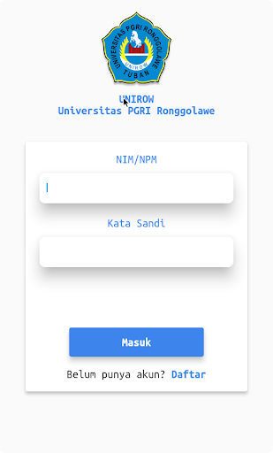
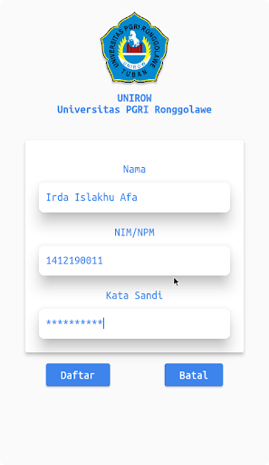
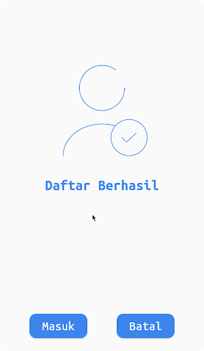
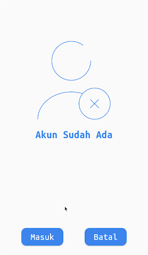
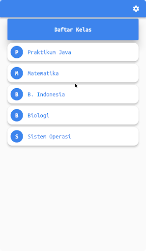
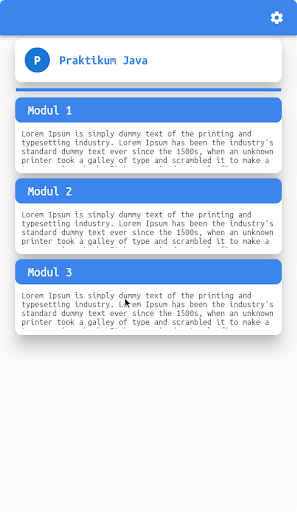
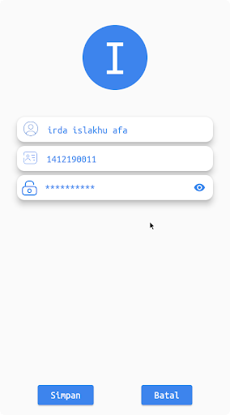

# CLASS ROOM (UAS ACADEMIC PROJECT)

My NPM is odd so i got an assignment to make an application about acacademics, and here i made a simple application with `Flutter (Dart Front-End Framework)` inspired by `Google Class Room`
Compiled application can be found di `app` directory

# Description

Currently this app have 6 simple page. Bellow is some of them and Figma design can be found [here](https://www.figma.com/file/5yg6buJLjYGRfLwfnhXO6V/Unirow-App?node-id=2%3A2&t=LqzOyrBP6PzSEEW4-1)

- Login

- Register

  - Register Success
 
  - Account Already Exists
 
- List Class

- Details Of Class

- Profile

